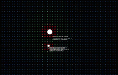

# nbody-sim

A minimal N-body gravitational simulation built in Godot.

## Controls

- `WASD` - Up, Down, Left, Right respectively.
- `MouseWheel Up/Down` - Rotation CCW, CW respectively.
- `QE` - Zoom In, Zoom Out respectively.
- `CTRL + MouseWheel Up/Down` - Velocity Up / Down respectively.
- `ALT + MouseWheel Up/Down` - Mass Up / Down respectively.

## License

This project is licensed under the MIT License - see LICENSE for more details.

## Author

a22Dv - a22dev.gl@gmail.com
